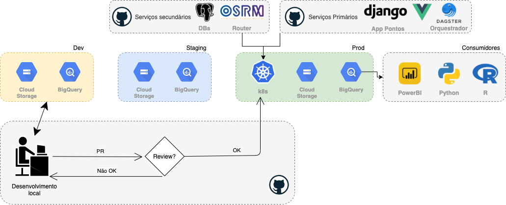

# Infraestrutura da SMTR

## Visão geral

A infraestrutura da SMTR é construída em cima do Google BigQuery. Os projetos estão divididos em:

- **dev**: ambiente de teste;
- **staging**: tabelas de staging do Base dos Dados no BigQuery
- **prod**: tabelas finais para consumo de outras áreas e aplicações.

Todo código das pipelinas de captura e/ou atualização das tabelas em desenvolvimento e produção estão
versionados no [Github](https://github.com/orgs/RJ-SMTR/).

## Datalake

### Visão geral

- Dagster:
    - Gerenciamento de views (maestro-bq): todas as tabelas não brutas 
    - Qualquer erro na pipeline é avisado no Discord

### Pipelines
- Lista das pipelines implementadas
- Fluxo de dados (dag)