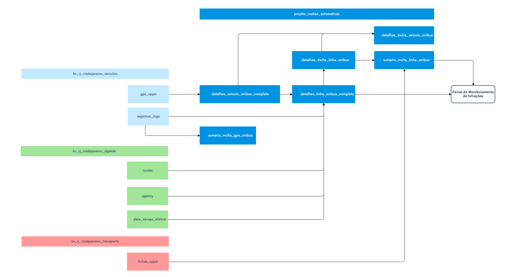

# Multas Automáticas - Pipeline

## Visão geral

O sistema utiliza dados de operação de veículos via GPS
  (SPPO) e dados de planejamento das linhas via SIGMOB, combinados às
  regras definidas na [metodologia](../pipelines/multas-automaticas.md), para gerar o
  registro das multas dos consórcios. Todo dia às 21h os dados são
  atualizados.

## Tabelas de análise

| tabela | descrição |
| ------ | ---------- | 
| sumario_multa_linha_onibus | Consolida as infrações passíveis de multa por linha e horário de pico (manhã/tarde). | 
| detalhes_linha_onibus_completa | Detalha informações de frota aferida e mínima por linha, indicadores de infrações cometidas e falhas de captura por faixa horária. |
| detalhes_multa_veiculo_onibus | Detalha todos os registros de infrações por linha, faixa horária e situação da operação (operando/garagem). |